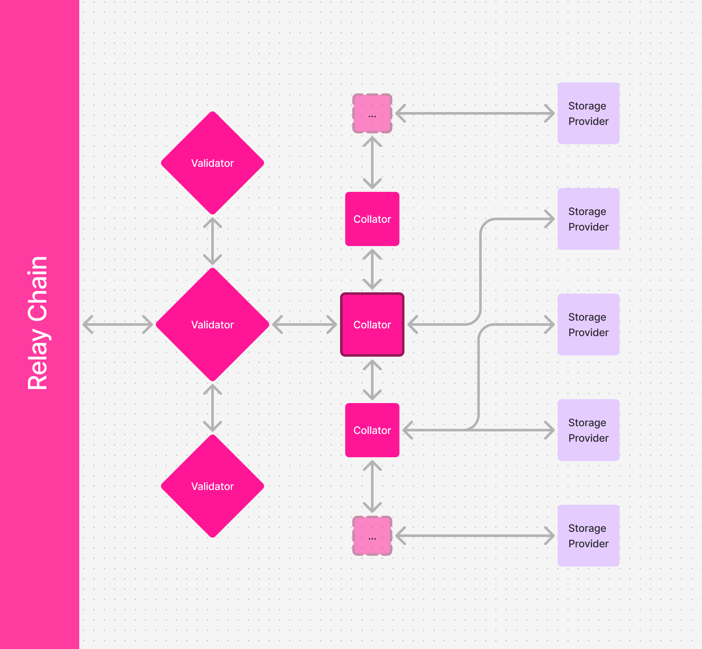
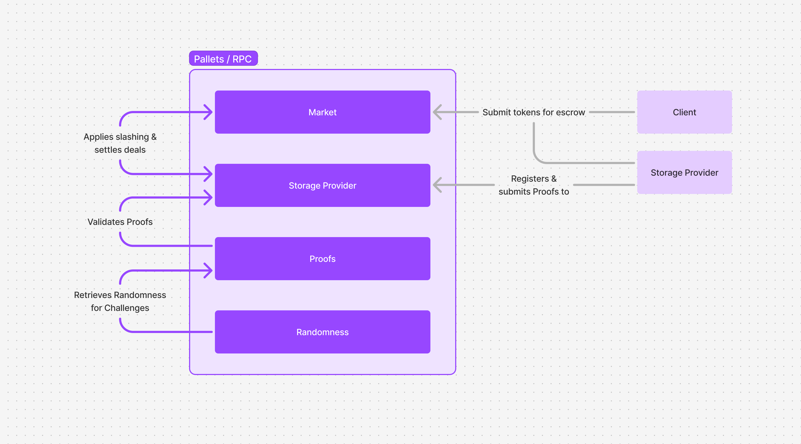

# Architecture Overview

The Polka Storage parachain is, just like other parachains, composed of collators that receive extrinsics calls,
and through them perform state transitions.

## System Overview

From left to right, we have validators (represented by a single node as only one validates blocks at a time),
collators and the storage providers.

The validators are handled by Polkadot itself — i.e. who gets to check the validity proofs is randomly selected by the network.

The collators execute our parachain runtime and process extrinsic calls from the storage providers — such as proof of storage submissions.

The storage providers are independent of the collators and are controlled by people like you, who provide storage to the system.
Storage management is left to the storage providers, being responsible to keep their physical system in good shape to serve clients.
We do provide an implementation of the storage provider, you can read more about it in the [Polka Storage Provider Server chapter](./polka-storage-provider-server.md).

## Pallets Overview

We've been focusing on implementing the core functionality by developing the market, storage provider, proofs and randomness pallets.

The market pallet handles all things related to deal payments and slashing,
being informed by the storage provider when deals haven't been proven and applying slashing in those cases.
The storage provider handles the registering of storage providers and the proof submission,
the latter is checked inside the collator's WASM runtime, using the proofs pallet.
Finally, the proofs pallet makes use of randomness for challenges, ensuring the storage providers can't cheat the system.

For a deeper dive on the pallets, you can read the [Pallets chapter](./pallets/index.md).

## Resources on Parachains

Reading:
* [Parachains' Protocol Overview](https://wiki.polkadot.network/docs/learn-parachains-protocol)
* [The Path of a Parachain Block](https://polkadot.com/blog/the-path-of-a-parachain-block)

Videos:
* [Introduction to Polkadot, Parachains, and Substrate](https://www.youtube.com/live/gT-9r1bcVHY?si=dmCJyWB5w2NY1bnu&t=1670)
* [The Path of a Parachain Block - Joe Petrowski](https://www.youtube.com/watch?v=vRsBlVELQEo)
* [The Path of a Parachain Block on Polkadot and Kusama Network](https://www.youtube.com/watch?v=m0vxqWwFfDs)

