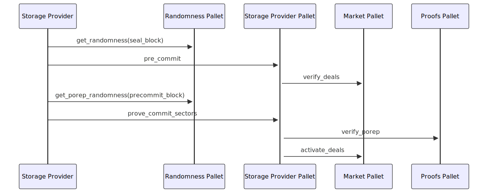

# Polka Storage pallets

- [`storage-provider`](storage-provider.md) - A pallet that manages storage providers and their associated data.
- [`market`](market.md) - A pallet that handles the storage market operations.
- [`proofs`](proofs.md) - A pallet responsible for verifying [PoRep](../../glossary.md#porep) and [PoSt](../../glossary.md#post).
- [`randomness`](randomness.md) - A pallet providing randomness source for blocks, mainly used by Proofs.

## Overview

The Polka Storage parachain is all about making storage deals. Let us go over how a deal is done!

Before anything else, [Storage Providers](../../glossary.md#storage-provider) need to register themselves with the [Storage Provider Pallet](./storage-provider.md) — they can do so using the [`register_storage_provider`](./storage-provider.md#register_storage_provider) extrinsic.

Now that storage providers can be registered in the storage provider pallet, we need to add some balance to both the
[Storage User's](../../glossary.md#storage-user) and the Provider's accounts,
which is done using the Market's [`add_balance`](./market.md#add_balance) extrinsic.

Afterwards, storage users and providers negotiate data storage deals off-chain.
Once a deal between the two parties is reached, the client can sign the deal and send it to the storage provider for publishing
— the storage provider will then publish the signed deal using the [`publish_storage_deals`](market.md#publish_storage_deals) extrinsic.

After publishing, the funds allocated for the deal will be moved from `free` to `locked`, and they can no longer be withdrawn until the deal has ended.

At this point, the remaining responsibility is shifted to the storage provider, which needs to activate the deal.
First, the storage provider needs to call `get_randomness` from the [Randomness Pallet](./randomness.md) in order to create a replica and
[pre-commit](./storage-provider.md#pre_commit_sectors) the deal's sectors.
The sealing and pre-committing takes some time, after that the storage provider needs to fetch yet another randomness seed to create a proof.
Subsequently, they [prove](./storage-provider.md#prove_commit_sectors) they stored the sectors by calling [`prove_commit_sectors`](./storage-provider.md#prove_commit_sectors) extrinsics.

Verification is done via the [Proofs Pallet](./proofs.md) and reported to the Market pallet to terminate the deal and apply penalties to the storage provider
(remove and burn its collateral — i.e. `locked` funds) if they fail to activate the deal on time and return the funds to the client.

Suppose the deal has been completed successfully or is **Active**.
In that case, the storage provider is now required to periodically submit proofs that they're still storing the user's data
— the storage provider does this by calculating a proof and submitting it using [`submit_windowed_post`](./storage-provider.md#submit_windowed_post).

Finally, storage providers can then settle deal payments to receive their fair share for keeping the user's data safe — using the [`settle_deal_payments`](./market.md#settle_deal_payments) extrinsic.

Putting it all together, we get the following:

