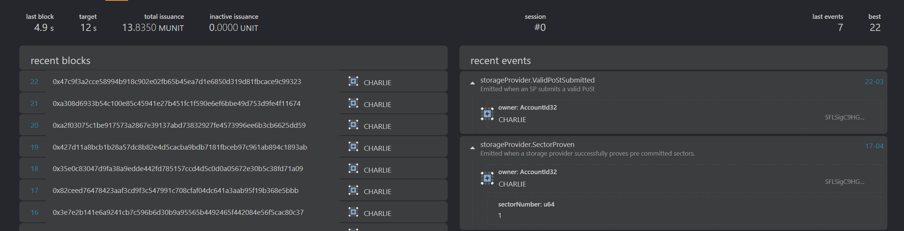

# Real-world use case demo

<div class="warning">
Before reading this guide, please follow the <a href="./local-testnet.md">local testnet</a> guide and have a working testnet running!
</div>

> For convenience's sake, we have a script that automates the actions in this guide.
> The script is available at the following link:
> <https://polka-storage.s3.eu-central-1.amazonaws.com/demo.sh>
>
> Alternatively, download and run in a single step:
>
> ```bash
> wget https://polka-storage.s3.eu-central-1.amazonaws.com/demo.sh
> chmod +x demo.sh
> ./demo.sh
> ```
>
> The script requires the `storagext-cli` binary to exist and be present in the `$PATH`.
> Instructions on how to achieve that are available in the [*Local Testnet - Polka Storage Parachain*](../getting-started/local-testnet.md) chapter.

A high-level overview with diagrams of the process described below can be found in <a href="../pallets/index.md">Pallets section</a>.

## 1. Publishing a deal

Charlie heard he could provide storage to people worldwide and earn some tokens,
so he decided to register as a [Storage Provider](../glossary.md).

```bash
$ storagext-cli --sr25519-key "//Charlie" storage-provider register Charlie
[0xd14d…4b6a] Storage Provider Registered: { owner: 5FLSigC9HGRKVhB9FiEo4Y3koPsNmBmLJbpXg2mp1hXcS59Y, info: Storage Provider Info: { peer_id: 3ZAB4sc5BS, window_post_proof_type: StackedDRGWindow2KiBV1P1, sector_size: _2KiB, window_post_partition_sectors: 2 }, proving_period_start: 21 }
```


Alice is a [Storage User](../glossary.md#storage-user) and wants to store an image of her lovely Husky (`husky.jpg`) in the Polka Storage [parachain](../glossary.md#parachain).

Alice knows[^no-cid] that she needs to get a [CID](https://github.com/multiformats/cid) of the image,
so she [uploaded it to the CAR server](../storage-provider-cli/storage.md#upload-a-file)
and received the CID: `bafybeihxgc67fwhdoxo2klvmsetswdmwwz3brpwwl76qizbsl6ypro6vxq`.

Alice heard somewhere[^no-sp-discovery] in the hallways of her favourite gym that Charlie is a Storage Provider.
She calls him (off-chain), and they negotiate a deal:

`husky-deal.json`

```json
[
  {
    "piece_cid": "bafybeihxgc67fwhdoxo2klvmsetswdmwwz3brpwwl76qizbsl6ypro6vxq",
    "piece_size": 1278,
    "client": "5GrwvaEF5zXb26Fz9rcQpDWS57CtERHpNehXCPcNoHGKutQY",
    "provider": "5FLSigC9HGRKVhB9FiEo4Y3koPsNmBmLJbpXg2mp1hXcS59Y",
    "label": "My lovely Husky (husky.jpg)",
    "start_block": 25,
    "end_block": 50,
    "storage_price_per_block": 1000000000,
    "provider_collateral": 12500000000,
    "state": "Published"
  }
]
```

| Name                      | Value                                                                                                                         | Description                                                                                                              |
| ------------------------- | ----------------------------------------------------------------------------------------------------------------------------- | ------------------------------------------------------------------------------------------------------------------------ |
| `piece_cid`               | `bafybeihxgc67fwhdoxo2klvmsetswdmwwz3brpwwl76qizbsl6ypro6vxq`                                                                 | The submitted file's CID                                                                                                 |
| `piece_size`              | `1278`                                                                                                                        | The submitted file's size                                                                                                |
| `client`                  | [`//Alice`](https://docs.substrate.io/reference/glossary/#dev-phrase) or `5GrwvaEF5zXb26Fz9rcQpDWS57CtERHpNehXCPcNoHGKutQY`   | The client's address                                                                                                     |
| `provider`                | [`//Charlie`](https://docs.substrate.io/reference/glossary/#dev-phrase) or `5FLSigC9HGRKVhB9FiEo4Y3koPsNmBmLJbpXg2mp1hXcS59Y` | The providers's address                                                                                                  |
| `start_block`             | `25`                                                                                                                          | When the deal should start                                                                                               |
| `end_block`               | `50`                                                                                                                          | When the deal should end                                                                                                 |
| `storage_price_per_block` | `1_000_000_000`                                                                                                               | In [Plancks](../glossary.md#planck), the storage price per block (12 sec)                                                |
| `provider_collateral`     | `12_500_000_000`                                                                                                              | In [Plancks](../glossary.md#planck), the price paid by the storage provider if they fail to uphold their end of the deal |

After the negotiation, they need to [add funds to the Pallet](../pallets/market.md#add_balance) and then [publish their intent](../pallets/market.md#publish_storage_deals) so it can be checked by the parachain.
So here they go:

```bash
# Adding balance to Alice's account
$ storagext-cli --sr25519-key "//Alice" market add-balance 25000000000
[0xe0bd…06f9] Balance Added: { account: 5GrwvaEF5zXb26Fz9rcQpDWS57CtERHpNehXCPcNoHGKutQY, amount: 25000000000 }
# Adding balance to Charlie's account
$ storagext-cli --sr25519-key "//Charlie" market add-balance 12500000000
[0x25aa…edd3] Balance Added: { account: 5FLSigC9HGRKVhB9FiEo4Y3koPsNmBmLJbpXg2mp1hXcS59Y, amount: 12500000000 }
# Publishing their deal
$ storagext-cli --sr25519-key  "//Charlie" market publish-storage-deals --client-sr25519-key  "//Alice" "@husky-deal.json"
[0xd50b…dee6] Deal Published: { deal_id: 0, provider_account: 5FLSigC9HGRKVhB9FiEo4Y3koPsNmBmLJbpXg2mp1hXcS59Y, client_account: 5GrwvaEF5zXb26Fz9rcQpDWS57CtERHpNehXCPcNoHGKutQY }
```

[^no-cid]: We have not provided a standalone command to generate CID out of the file. The CAR server is a temporary showcase component.
[^no-sp-discovery]: We have not yet implemented Storage Provider Discovery protocol.

## 2. Committing a deal

After the deals have been published, the rest is up to Charlie.
If Charlie does not behave appropriately, [pre-commit](../pallets/storage-provider.md#pre_commit_sector) and [prove](../pallets/storage-provider.md#prove_commit_sector) the deal by block 25 (`start_block`),
he will be slashed, and all his funds [(`provider_collateral`)](../glossary.md#collateral) will be gone.[^slash]
So he should do his part!

`pre-commit-husky.json`

```json
{
  "sector_number": 1,
  "sealed_cid": "bafk2bzaceajreoxfdcpdvitpvxm7vkpvcimlob5ejebqgqidjkz4qoug4q6zu",
  "deal_ids": [0],
  "expiration": 75,
  "unsealed_cid": "bafk2bzaceajreoxfdcpdvitpvxm7vkpvcimlob5ejebqgqidjkz4qoug4q6zu",
  "seal_proof": "StackedDRG2KiBV1P1"
}
```

| Name                                                                                                           | Value                | Description                                                                                                        |
| -------------------------------------------------------------------------------------------------------------- | -------------------- | ------------------------------------------------------------------------------------------------------------------ |
| [`sector_number`](../glossary.md#sector)                                                                       | 1                    | The place where `husky.jpg` will be stored. Charlie decided it'll be on his 1st sector.                            |
| `deal_ids`                                                                                                     | `[0]`                | A sector can contain multiple deals, but it only contains the first one ever created (id: 0).                      |
| `expiration`                                                                                                   | `75`                 | The 75th block is 5 minutes after the `end_block`, so the sector expires only after the deal has been terminated. |
| [`sealed_cid`](../glossary.md#commitment-of-replication), [`unsealed_cid`](../glossary.md#commitment-of-data), | multiple             | Currently, placeholder values (any CID) since the proof mechanism is a work-in-progress.                            |
| `seal_proof`                                                                                                   | `StackedDRG2KiBV1P1` | Currently, we only accept sector sizes of 2KiB, so this is the only value possible.                                 |

`prove-commit-husky.json`
```json
{
  "sector_number": 1,
  "proof": "1230deadbeef"
}
```

- `proof`: hex string of bytes of the proof, it's WIP, so any non-zero value works.

```bash
$ storagext-cli --sr25519-key "//Charlie" storage-provider pre-commit "@pre-commit-husky.json"
[0xf2ad…dc3d] Sector Pre-Committed: { owner: 5FLSigC9HGRKVhB9FiEo4Y3koPsNmBmLJbpXg2mp1hXcS59Y, sector_number: Sector Pre-Commit Info: { sector_number: 1, expiration: 75, seal_proof: RegisteredSealProof::StackedDRG2KiBV1P1, unsealed_cid: bafk2bzaceajreoxfdcpdvitpvxm7vkpvcimlob5ejebqgqidjkz4qoug4q6zu, sealed_cid: bafk2bzaceajreoxfdcpdvitpvxm7vkpvcimlob5ejebqgqidjkz4qoug4q6zu } }
$ storagext-cli --sr25519-key "//Charlie" storage-provider prove-commit "@prove-commit-husky.json"
[0x0743…6fd3] Sector Proven: { owner: 5FLSigC9HGRKVhB9FiEo4Y3koPsNmBmLJbpXg2mp1hXcS59Y, sector_number: 1, partition_number: 0, deadline_idx: 0 }
```


[^slash]: Wait for 5 minutes and observe a `DealSlashed` [Event](../pallets/market.md#events) being published.

## 3. Proofs and faults

### Aside on Deadlines

There is a little something that Charlie needs to know about: deadlines *(don't we all...)*.

Each Storage Provider has a Proving Period, a time divided into segments (deadlines).
To simplify, let's say a proving period lasts a day (24 hours), and between the start and end of each hour, there is a segment, just like on a clock.


Now, when Charlie gathers enough data and stores it in a sector, he must keep proving that he has some data.
Charlie can have multiple sectors and he doesn't want to overload the system by proving all of them simultaneously.
So what if each sector got assigned a segment (1 hour) during the day, and Charlie would need to submit proof that he has data roughly on the same hour each day?
That'd work, right?

So this is what a Proving Period and Deadlines are.
We divide a proving period into deadlines and when we prove commit, we assign a sector to a deadline.
From now on, the sector must be proven periodically and daily during this lifetime.

`windowed-post.json`
```json
{
  "deadline": 0,
  "partitions": [0],
  "proof": {
    "post_proof": "2KiB",
    "proof_bytes": "1230deadbeef"
  }
}
```


| Name          | Value            | Description                                                                   |
| ------------- | ---------------- | ----------------------------------------------------------------------------- |
| `deadline`    | `0`              | the deadline index which has been assigned by the Prove Commit                |
| `partitions`  | `[0]`            | the partitions which have been assigned by Prove Commit                       |
| `post_proof`  | "2KiB"           | we only support sectors of size 2KiB for now, so it's the only possible value |
| `proof_bytes` | `0x1230deadbeef` | hex string of bytes of the proof, it's WIP, so any non-zero value works       |

Now that the sector has been proven, Charlie must keep confirming that he stores the data.
Charlie's proving period starts at block `21` (as `register-storage-provider` tells us), so the first deadline is between blocks `[21, 31)`, second `[31, 41)`.
That's because there are [2 deadlines](#const-period-deadlines) within a [proving period](#const-proving-period), and a deadline has a [window of 10 blocks](#const-challenge-window).
Charlie got assigned the first deadline, so he waits until block `21` to send the proof that he still stores the data.

```bash
$ storagext-cli --sr25519-key "//Charlie" storage-provider submit-windowed-post "@windowed-post.json"
[0x3aa1…a12a] Valid PoSt Submitted: { owner: 5FLSigC9HGRKVhB9FiEo4Y3koPsNmBmLJbpXg2mp1hXcS59Y }
```



The next proving period starts at block `41`, with the deadline `[41, 51)`, so Charlie must submit his proof on this block.
He knows he won't be able to create a proof, as his hard drives went down, so he reports it. If he didn't report, he'd get slashed.

`fault-declaration.json`

```json
[
  {
    "deadline": 0,
    "partition": 0,
    "sectors": [1]
  }
]
```

```bash
$ storagext-cli --sr25519-key "//Charlie" storage-provider declare-faults "@fault-declaration.json"
[0x49cd…9a88] Faults Declared: { owner: 5FLSigC9HGRKVhB9FiEo4Y3koPsNmBmLJbpXg2mp1hXcS59Y, faults: [Fault Declaration: { deadline: 0, partition: 0, sectors: [1] }] }
```


Charlie fixed his issues with storage and now wants to declare that he can still provide data in this sector.
If he does this too late (1 minute before the next deadline starts), he won't be able to.

```bash
$ storagext-cli --sr25519-key "//Charlie" storage-provider declare-faults-recovered "@fault-declaration.json"
Error: Runtime error: Pallet error: StorageProvider::FaultRecoveryTooLate

Caused by:
    Pallet error: StorageProvider::FaultRecoveryTooLate
```


If he does it at least a minute before, it succeeds:

```bash
$ storagext-cli --sr25519-key "//Charlie" storage-provider declare-faults-recovered "@fault-declaration.json"
[0xca6b…875c] Faults Recovered: { owner: 5FLSigC9HGRKVhB9FiEo4Y3koPsNmBmLJbpXg2mp1hXcS59Y, recoveries: [Recovery Declaration: { deadline: 0, partition: 0, sectors: [1] }] }
```

And then, at the next deadline, in the next proving period `[41, 51)` he needs to remember to submit windowed PoSt again.

```bash
$ storagext-cli --sr25519-key "//Charlie" storage-provider submit-windowed-post "@windowed-post.json"
[0x3e46…5636] Valid PoSt Submitted: { owner: 5FLSigC9HGRKVhB9FiEo4Y3koPsNmBmLJbpXg2mp1hXcS59Y }
```

## 4. Reaping the rewards

After the deal ends (after block `50`), Charlie goes to get his rewards!
First, he settles all of the locked funds, so his balance gets unlocked, and then he withdraws the balance from his Market account to use his DOTs for a new shiny dumbbell.

```bash
$ storagext-cli --sr25519-key "//Charlie" market settle-deal-payments 0
[0x1633…d17b] Deals settled: { successful: [Settled Deal { deal_id: 0, provider_account: 5FLSigC9HGRKVhB9FiEo4Y3koPsNmBmLJbpXg2mp1hXcS59Y, client_account: 5GrwvaEF5zXb26Fz9rcQpDWS57CtERHpNehXCPcNoHGKutQY, amount: 25000000000 }], unsuccessful: [] }
$ storagext-cli --sr25519-key "//Charlie" market withdraw-balance 37500000000
[0x0197…bdd9] Balance Withdrawn: { account: 5FLSigC9HGRKVhB9FiEo4Y3koPsNmBmLJbpXg2mp1hXcS59Y, amount: 37500000000 }
```
