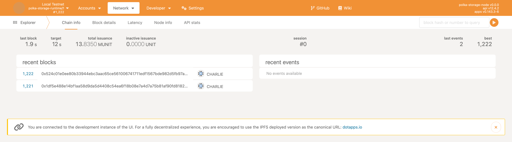

# Local Testnet - Polka Storage Parachain

This guide will help you set up a local parachain network using zombienet.
At the end, we will have three nodes: Alice, Bob and Charlie.
Alice and Bob will be running Polkadot relay chain nodes as validators,
and Charlie will run a relay chain and parachain node.
Charlie will be our contact point to the parachain network.

## Native Binaries

You can download our latest releases's binaries directly and run them on your machine without additional dependencies.
We support `Linux x86_64` and `MacOS ARM x64`. The commands below will download:

- [Relay Chain](https://github.com/paritytech/polkadot-sdk/releases) binaries (`polkadot`, `polkadot-prepare-worker`, `polkadot-execute-worker`),
- Polka Storage Parachain binary (`polka-storage-node`),
- [Polka Storage Provider](../storage-provider-cli/index.md) internal node (`polka-storage-provider`),
- [CLI for interacting with the parachain](../storagext-cli/) (`storagext-cli`),
- [zombienet](https://paritytech.github.io/zombienet/install.html) to spawn local testnets and orchestrate them (`zombienet`),
- Polka Storage Parachain out-of-the-box zombienet's configuration (`polka-storage-testnet.toml`).

### Linux x86_64

1. Download the binaries:

```bash
wget https://github.com/paritytech/polkadot-sdk/releases/download/polkadot-v1.13.0/polkadot
wget https://github.com/paritytech/polkadot-sdk/releases/download/polkadot-v1.13.0/polkadot-prepare-worker
wget https://github.com/paritytech/polkadot-sdk/releases/download/polkadot-v1.13.0/polkadot-execute-worker
wget https://s3.eu-central-1.amazonaws.com/polka-storage/linux_x86-64/polka-storage-node
wget https://s3.eu-central-1.amazonaws.com/polka-storage/linux_x86-64/polka-storage-provider
wget https://s3.eu-central-1.amazonaws.com/polka-storage/linux_x86-64/storagext-cli
wget https://github.com/paritytech/zombienet/releases/download/v1.3.106/zombienet-linux-x64 -O zombienet
```

2. Setup permissions:

```bash
chmod +x zombienet polka-storage-node polka-storage-provider storagext-cli polkadot polkadot-prepare-worker polkadot-execute-worker
```

3. Run `zombienet`:

```bash
export PATH=$(pwd):$PATH

wget https://s3.eu-central-1.amazonaws.com/polka-storage/polka-storage-testnet.toml
zombienet -p native spawn polka-storage-testnet.toml
```

### MacOS ARM

1. Download the binaries:

```bash
wget https://s3.eu-central-1.amazonaws.com/polka-storage/macos_arm/polkadot
wget https://s3.eu-central-1.amazonaws.com/polka-storage/macos_arm/polkadot-prepare-worker
wget https://s3.eu-central-1.amazonaws.com/polka-storage/macos_arm/polkadot-execute-worker
wget https://s3.eu-central-1.amazonaws.com/polka-storage/macos_arm/polka-storage-node
wget https://s3.eu-central-1.amazonaws.com/polka-storage/macos_arm/polka-storage-provider
wget https://s3.eu-central-1.amazonaws.com/polka-storage/macos_arm/storagext-cli
wget https://github.com/paritytech/zombienet/releases/download/v1.3.106/zombienet-macos-arm64 -O zombienet
```

2. Setup permissions & de-quarantine:

```bash
chmod +x zombienet polka-storage-node polka-storage-provider storagext-cli polkadot polkadot-prepare-worker polkadot-execute-worker
xattr -d com.apple.quarantine zombienet polka-storage-node polka-storage-provider storagext-cli polkadot polkadot-prepare-worker polkadot-execute-worker
```

<div class="warning">
If, when running the <code>xattr</code> command, it outputs <code>No such attr: com.apple.quarantine</code>, there's nothing to worry about. It means the downloaded binaries were not quarantined.
</div>

3. Run `zombienet`:

```bash
export PATH=$(pwd):$PATH

wget https://s3.eu-central-1.amazonaws.com/polka-storage/polka-storage-testnet.toml
zombienet -p native spawn polka-storage-testnet.toml
```

You can easily access the parachain using the Polkadot.js Apps interface by clicking on this link:
<https://polkadot.js.org/apps/?rpc=ws://127.0.0.1:42069#/explorer>

Where you should be greeted by a page like this:

<p>
  <a href="https://polkadot.js.org/apps/?rpc=ws://127.0.0.1:42069#/explorer">
    
  </a>
</p>

Or you can interact with the chain via [`storagext-cli`](../storagext-cli/index.md), for example:

```bash
storagext-cli --sr25519-key "//Alice" storage-provider register Alice
```

## Kubernetes

<div class="warning">
Docker Images were only published on x86_64 platforms! They won't work on Kubernetes on MacOS.
</div>

### Prerequisites

- [zombienet v1.3.106](https://github.com/paritytech/zombienet/releases/tag/v1.3.106) - cli tool to easily spawn ephemeral Polkadot/Substrate networks and perform tests against them.
- [minikube](https://minikube.sigs.k8s.io/docs/start/) — to run the parachain nodes
- a configured [kubectl](https://kubernetes.io/docs/tasks/tools/#kubectl) — is used to set up the required kubernetes resources by `zombienet`
  - [https://minikube.sigs.k8s.io/docs/handbook/kubectl/](https://minikube.sigs.k8s.io/docs/handbook/kubectl/)
  - [https://kubernetes.io/docs/tasks/tools/#kubectl](https://kubernetes.io/docs/tasks/tools/#kubectl)

### Start up the Kubernetes cluster

Using `minikube`, you can start the cluster with the following command:

```
minikube start
```

You can read more about `minikube` on its [Getting Started](https://minikube.sigs.k8s.io/docs/handbook/controls/) page.

### Running the Parachain

1. Create a `local-kube-testnet.toml` file on your machine with the following content.

```toml
[settings]
image_pull_policy = "IfNotPresent"

[relaychain]
chain = "rococo-local"
default_args = ["--detailed-log-output", "-lparachain=debug,xcm=trace,runtime=trace"]
default_image = "docker.io/parity/polkadot:v1.13.0"

[[relaychain.nodes]]
name = "alice"
validator = true

[[relaychain.nodes]]
name = "bob"
validator = true

[[parachains]]
cumulus_based = true

# We need to use a Parachain of an existing System Chain (https://github.com/paritytech/polkadot-sdk/blob/master/polkadot/runtime/rococo/src/xcm_config.rs).
# The reason: being able to get native DOTs from Relay Chain to Parachain via XCM Teleport.
# We'll have a proper Parachain ID in the *future*, but for now, let's stick to 1000 (which is AssetHub and trusted).
id = 1000

# Run Charlie as parachain collator
[[parachains.collators]]
args = ["--detailed-log-output", "-lparachain=debug,xcm=trace,runtime=trace"]
command = "polka-storage-node"
image = "polkadotstorage.azurecr.io/parachain-node:0.1.0"
name = "charlie"
rpc_port = 42069
validator = true
```

2. Run the Parachain, and spawn the zombienet testnet in the Kubernetes cluster:

```
zombienet -p kubernetes spawn local-kube-testnet.toml
```

<details>
<summary>Click here to show the example output.</summary>

```
│ /ip4/10.1.0.16/tcp/30333/ws/p2p/12D3KooWPKzmmE2uYgF3z13xjpbFTp63g9dZFag8pG6MgnpSLF4S                                   │
└────────────────────────────────────────────────────────────────────────────────────────────────────────────────────────┘

         Warn: Tracing collator service doesn't exist
┌───────────────────────────────────────────────────────────────────────────────────────────────────────────────────────────────────┐
│                                                       Network launched 🚀🚀                                                       │
├──────────────────────────────┬────────────────────────────────────────────────────────────────────────────────────────────────────┤
│ Namespace                    │ zombie-1cecb9b5e0f9a14208f2fbefd9384490                                                            │
├──────────────────────────────┼────────────────────────────────────────────────────────────────────────────────────────────────────┤
│ Provider                     │ kubernetes                                                                                         │
├──────────────────────────────┴────────────────────────────────────────────────────────────────────────────────────────────────────┤
│                                                         Node Information                                                          │
├──────────────────────────────┬────────────────────────────────────────────────────────────────────────────────────────────────────┤
│ Name                         │ alice                                                                                              │
├──────────────────────────────┼────────────────────────────────────────────────────────────────────────────────────────────────────┤
│ Direct Link                  │ https://polkadot.js.org/apps/?rpc=ws%3A%2F%2F127.0.0.1%3A34341#/explorer                           │
├──────────────────────────────┼────────────────────────────────────────────────────────────────────────────────────────────────────┤
│ Prometheus Link              │ http://127.0.0.1:35537/metrics                                                                     │
├──────────────────────────────┼────────────────────────────────────────────────────────────────────────────────────────────────────┤
│ Log Cmd                      │ kubectl logs -f alice -c alice -n zombie-1cecb9b5e0f9a14208f2fbefd9384490                          │
├──────────────────────────────┴────────────────────────────────────────────────────────────────────────────────────────────────────┤
│                                                         Node Information                                                          │
├──────────────────────────────┬────────────────────────────────────────────────────────────────────────────────────────────────────┤
│ Name                         │ bob                                                                                                │
├──────────────────────────────┼────────────────────────────────────────────────────────────────────────────────────────────────────┤
│ Direct Link                  │ https://polkadot.js.org/apps/?rpc=ws%3A%2F%2F127.0.0.1%3A44459#/explorer                           │
├──────────────────────────────┼────────────────────────────────────────────────────────────────────────────────────────────────────┤
│ Prometheus Link              │ http://127.0.0.1:43841/metrics                                                                     │
├──────────────────────────────┼────────────────────────────────────────────────────────────────────────────────────────────────────┤
│ Log Cmd                      │ kubectl logs -f bob -c bob -n zombie-1cecb9b5e0f9a14208f2fbefd9384490                              │
├──────────────────────────────┴────────────────────────────────────────────────────────────────────────────────────────────────────┤
│                                                         Node Information                                                          │
├──────────────────────────────┬────────────────────────────────────────────────────────────────────────────────────────────────────┤
│ Name                         │ charlie                                                                                            │
├──────────────────────────────┼────────────────────────────────────────────────────────────────────────────────────────────────────┤
│ Direct Link                  │ https://polkadot.js.org/apps/?rpc=ws%3A%2F%2F127.0.0.1%3A42069#/explorer                           │
├──────────────────────────────┼────────────────────────────────────────────────────────────────────────────────────────────────────┤
│ Prometheus Link              │ http://127.0.0.1:42675/metrics                                                                     │
├──────────────────────────────┼────────────────────────────────────────────────────────────────────────────────────────────────────┤
│ Log Cmd                      │ kubectl logs -f charlie -c charlie -n zombie-1cecb9b5e0f9a14208f2fbefd9384490                      │
├──────────────────────────────┼────────────────────────────────────────────────────────────────────────────────────────────────────┤
│ Parachain ID                 │ 1000                                                                                               │
├──────────────────────────────┼────────────────────────────────────────────────────────────────────────────────────────────────────┤
│ ChainSpec Path               │ /tmp/zombie-1cecb9b5e0f9a14208f2fbefd9384490_-29755-WOCdKtq9zPGA/1000-rococo-local.json            │
└──────────────────────────────┴────────────────────────────────────────────────────────────────────────────────────────────────────┘
```

</details>

### Verifying the Setup

Check if all zombienet pods were started successfully:

`kubectl get pods --all-namespaces`

<details>
<summary>Click here to show the example output.</summary>

```
...
zombie-01b7920d650c18d3d78f75fd8b0978af   alice                              1/1     Running     0               77s
zombie-01b7920d650c18d3d78f75fd8b0978af   bob                                1/1     Running     0               62s
zombie-01b7920d650c18d3d78f75fd8b0978af   charlie                            1/1     Running     0               49s
zombie-01b7920d650c18d3d78f75fd8b0978af   fileserver                         1/1     Running     0               2m28s
zombie-01b7920d650c18d3d78f75fd8b0978af   temp                               0/1     Completed   0               2m25s
zombie-01b7920d650c18d3d78f75fd8b0978af   temp-1                             0/1     Completed   0               2m25s
zombie-01b7920d650c18d3d78f75fd8b0978af   temp-2                             0/1     Completed   0               2m15s
zombie-01b7920d650c18d3d78f75fd8b0978af   temp-3                             0/1     Completed   0               2m1s
zombie-01b7920d650c18d3d78f75fd8b0978af   temp-4                             0/1     Completed   0               114s
zombie-01b7920d650c18d3d78f75fd8b0978af   temp-5                             0/1     Completed   0               91s
zombie-01b7920d650c18d3d78f75fd8b0978af   temp-collator                      0/1     Completed   0               104s
```

</details>

### Accessing the Parachain

You can easily access the parachain using the Polkadot.js Apps interface by clicking on this link:

[https://polkadot.js.org/apps/?rpc=ws%3A%2F%2F127.0.0.1%3A42069#/explorer](https://polkadot.js.org/apps/?rpc=ws%3A%2F%2F127.0.0.1%3A42069#/explorer)

This link will automatically connect to Charlie's node running on your local machine at port `42069`. The port is configured in `local-kube-testnet.toml` under `rpc_port` for Charlie's node.

## Zombienet Configuration Breakdown

During the setup, you either download a file in the third step of [Linux](#linux-x86_64)/[MacOS](#macos-arm) — `polka-storage-testnet.toml` —
or copy it from the first step of [Running the parachain](#running-the-parachain).

### Similarities

The two files share most of the contents, so we'll start by covering their similarities.
For more details, you should refer to the [`zombienet` documentation](https://paritytech.github.io/zombienet/network-definition-spec.html):

#### `relaychain`

| Name              | Description                                   |
| ----------------- | --------------------------------------------- |
| `chain`           | The relaychain name                           |
| `default_args`    | The default arguments passed to the `command` |
| `default_command` | The default command to run the relaychain     |
| `nodes`           | List of tables defining the nodes to run      |

##### `nodes`

| Name        | Description                            |
| ----------- | -------------------------------------- |
| `name`      | The node name                          |
| `validator` | Whether the node is a validator or not |

#### `parachains`

A list of tables defining multiple parachains, in our case, we only care for our own parachain.

| Name            | Description                                                   |
| --------------- | ------------------------------------------------------------- |
| `cumulus_based` | Whether to use `cumulus` based generation                     |
| `id`            | The parachain ID, we're using `1000` as a placeholder for now |
| `collators`     | List of tables defining the collators                         |

##### `collators`

| Name        | Description                              |
| ----------- | ---------------------------------------- |
| `args`      | The arguments passed to the `command`    |
| `command`   | The command to run the collator          |
| `name`      | The collator name                        |
| `validator` | Whether the collator is also a validator |

### Differences

The difference between them lies in the usage of container configurations:

| Name                 | Description                                                                                                                                                                   |
| -------------------- | ----------------------------------------------------------------------------------------------------------------------------------------------------------------------------- |
| `image_pull_policy`  | Defines when `zombienet` should pull an image; read more about it in the [Kubernetes documentation](https://kubernetes.io/docs/concepts/containers/images/#image-pull-policy) |
| `image`              | Defines which image to pull                                                                                                                                                   |
| `ws_port`/`rpc_port` | Depending on the type of configuration (Native or Kubernetes), this variable sets the port for the collator RPC service                                                       |
