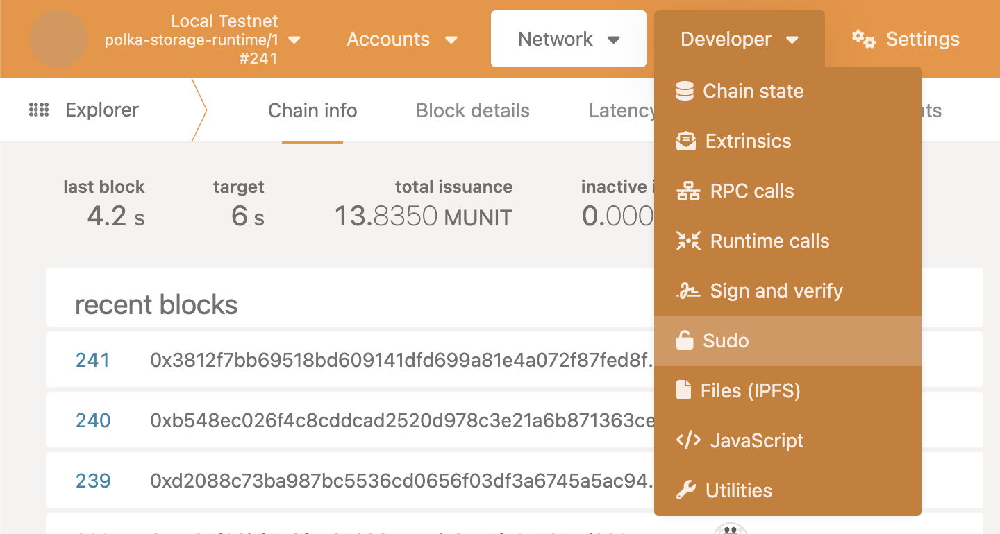
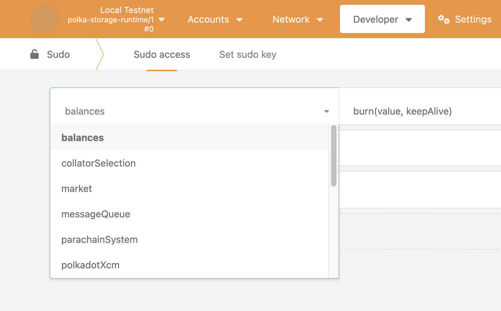
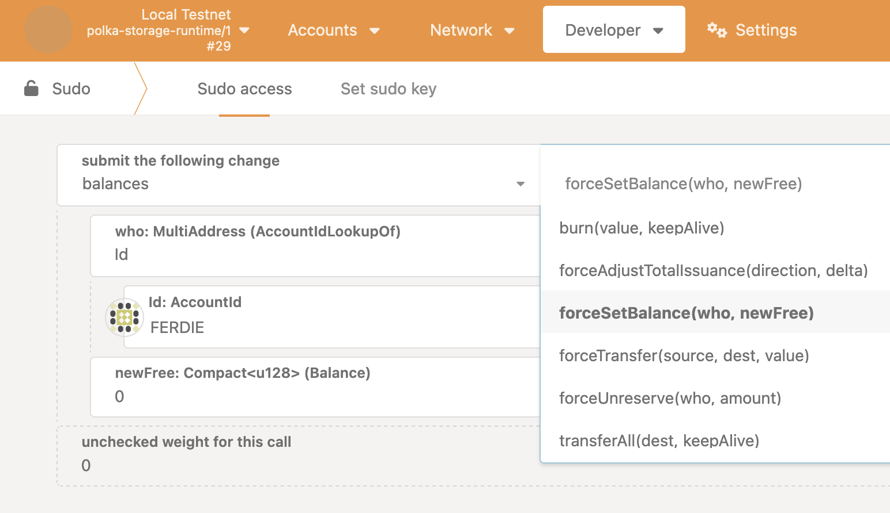
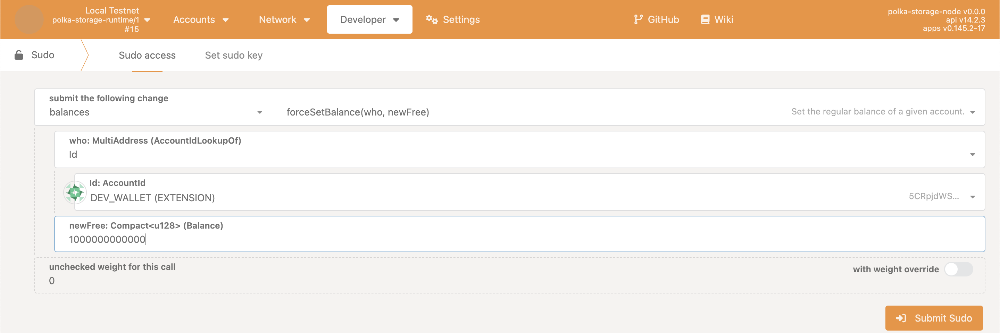
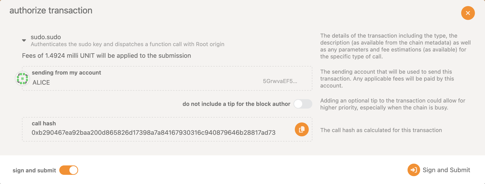
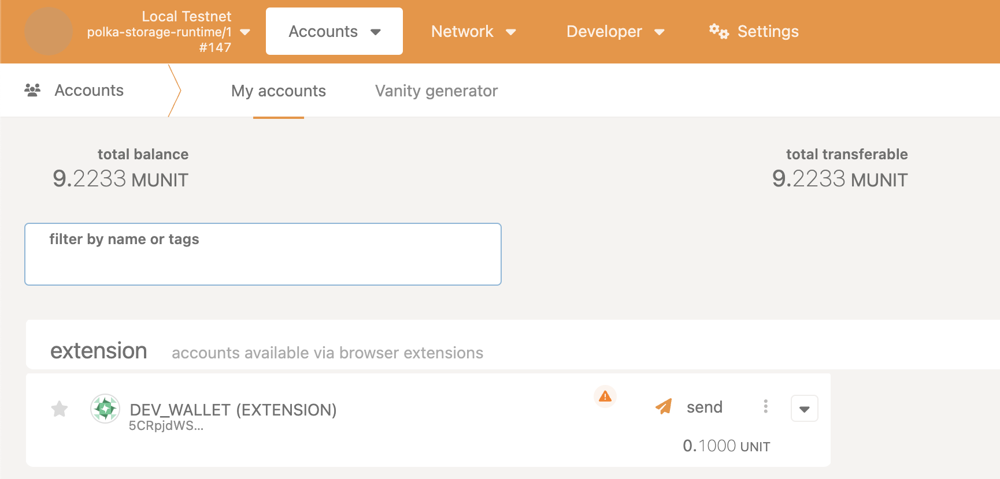

# Getting funds

This document covers getting funds into an account that has been generated externally.

## Setting up your account

In this guide we will be covering getting funds into a externally generated account. The recommended way to generate an account is by using the [polkadot.js wallet extension](https://github.com/polkadot-js/extension).

Please make sure to follow the instructions on how to generate a new account if you have not done so already.
You can read more about creating a Polkadot account using the extension in the following [link](https://support.polkadot.network/support/solutions/articles/65000098878-how-to-create-a-dot-account#How-to-create-an-account-with-the-Polkadot-extension)

Or you can watch the following video:
<iframe
    style="display:block; margin-left:auto; margin-right:auto"
    width="560"
    height="315"
    src="https://www.youtube-nocookie.com/embed/DNU0p5G0Gqc?si=L_rsjH8zYDmNKVBB"
    title="YouTube video player"
    frameborder="0"
    allow="accelerometer; autoplay; clipboard-write; encrypted-media; gyroscope; picture-in-picture; web-share"
    referrerpolicy="strict-origin-when-cross-origin" allowfullscreen></iframe>

## Dripping funds using the storagext CLI

Make sure to run the local testnet, you can find how to do so in the [local testnet guide](index.md).

Once the local testnet is up and running we can drip funds into the account.

Funds can be dripped using a single command:

```bash
storagext-cli faucet drip <ACCOUNT>
```

Where the `<ACCOUNT>` is the [SS58 address](https://docs.substrate.io/learn/accounts-addresses-keys/) generated in the previous steps.

> For more information about the faucet pallet and the storagext faucet subcommand check out their respective documenation.
>
> [Faucet pallet docs link](../../architecture/pallets/faucet.md)
>
> [storagext faucet subcommand docs link](../../storagext-cli/faucet.md)

## Getting funds through the Sudo pallet

Make sure to run the local testnet, you can find how to do so in the [local testnet guide](index.md). Once the local testnet is up and running navigate to the polkadot-js web app interface by going to the [default polkadot.js web interface URL](https://polkadot.js.org/apps/?rpc=ws://127.0.0.1:42069).

> If you have changed the `ws_port` value in the zombienet configuration — `local-testnet.toml`,
> this URL is different and you should change the port accordingly.

Under the developer tab, navigate to *Sudo*.



Once you are in *Sudo* you should select `balances` from the submit dropdown.



Then, on the box to the right, select `forceSetBalance` from the dropdown.



Setting the `Id` field to your generated address and the `newFree` field to the amount in [plancks](../../glossary.md#planck),
as shown in the image below.
If your polkadot.js extension is injected into the polkadot.js web interface it will recognize the injection and you can select the desired account.

<div class="warning">

Note that the `forceSetBalance` extrinsic does **NOT** add tokens to an account but rather **sets the balance** to the given amount.

</div>



Sign and submit your transaction, the caller will automatically be set to Alice, a dev account.



After the block has been finalized, the balance will show up in the generated account under the accounts tab and you are ready to start using the polka-storage chain with your own account.


