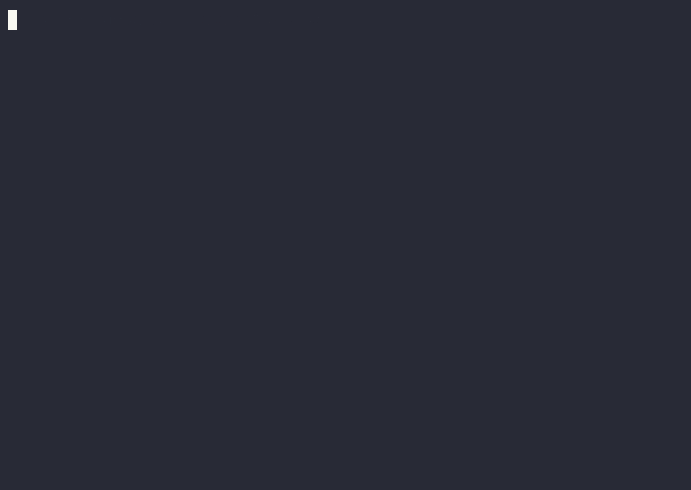

# Introduction

Welcome to the Polka Storage project!

This project aims to deliver a Polkadot-native system parachain for data storage.

Since the Referendum approval, we've been busy developing the parachain,
and this is our deliverable for Phase 1, composed of:

- Filecoin actor ports:
  - [Storage Provider](./pallets/storage-provider.md) — excluding proving mechanisms
  - [Market](./pallets/market.md)
- [CAR file conversion server](./storage-provider-cli/storage.md)
- Dedicated CLIs
  - [`storage-provider-cli`](./storage-provider-cli/storage.md) to generate keys and test our CARv2 Rust implementation!
  - [`storagext-cli`](./storagext-cli/index.md) (shown below) to take the parachain for a spin!

    

The following on-chain logic has been implemented:

- Keeping track of [Storage Providers](./glossary.md#storage-provider),
- [Publishing](./pallets/market.md#publish_storage_deals) Market Deals on-chain,
- [Investing](./pallets/market.md#add_balance) tokens into the Storage Market,
- [Receiving](./pallets/market.md#settle_deal_payments) funds after completing a deal,
- [Commiting](./pallets/storage-provider.md#pre_commit_sector) to the Storage and [Proving](./pallets/storage-provider.md#prove_commit_sector) the storage,
- [Declaring](./pallets/storage-provider.md#prove_commit_sector) failures to deliver committed storage and [Recovering](./pallets/storage-provider.md#declaring-storage-faults-recovered) from it,
- [Continuously proving](./pallets/storage-provider.md#submit_windowed_post) that the promise of storage has been kept up [PoSt proof](./glossary.md#proofs),
- [Punishing](./pallets/storage-provider.md#events) for failing to provide storage.

We present a complete [real-world scenario](./getting-started/demo.md) in which a [Storage Provider](./glossary.md#storage-provider) and a [Storage User](./glossary.md#storage-user) negotiate a deal, perform all the steps necessary to start the storage and then receive rewards (or punishments) for making it happen.

More information available about the project's genesis in:

- OpenGov Referendum — <https://polkadot.polkassembly.io/referenda/494>
- Research Report — <https://github.com/eigerco/polkadot-native-storage/blob/main/doc/report/polkadot-native-storage-v1.0.0.pdf>
- Polkadot Forum News Post — <https://forum.polkadot.network/t/polkadot-native-storage/4551>

---

    

