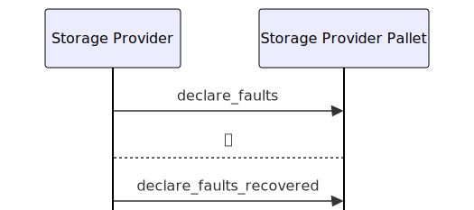

# Storage Provider Pallet

## Table of Contents

- [Overview](#overview)
- [Usage](#usage)
  - [Declaring storage faults and recoveries](#declaring-storage-faults-and-recoveries)
- [Extrinsics](#extrinsics)
  - [`register_storage_provider`](#register_storage_provider)
  - [`pre_commit_sector`](#pre_commit_sector)
  - [`prove_commit_sector`](#prove_commit_sector)
  - [`submit_windowed_post`](#submit_windowed_post)
  - [`declare_faults`](#declare_faults)
  - [`declare_faults_recovered`](#declare_faults_recovered)
- [Events](#events)
- [Errors](#errors)
- [Pallet constants](#pallet-constants)

## Overview

The `Storage Provider Pallet` handles the creation of storage providers and facilitates storage providers and clients in creating storage deals.
Storage providers must provide the [Proof of Space-time (PoSt)](../glossary.md#post) and the [Proof of Replication (PoRep)](../glossary.md#porep)
to the `Storage Provider Pallet` to prevent the pallet from imposing penalties on storage providers through [slashing](#storage-fault-slashing).

## Usage

### Declaring storage faults and recoveries

Faulty sectors are subject to penalties. To minimize said penalties, the storage provider should declare any sector for which they cannot
generate a [PoSt](../glossary.md#post) as faulty, this will mask said sectors in future deadlines, minimizing the suffered penalties.
A storage provider must declare the sector as faulty [**before**](#fault-declaration-cutoff) the challenge window.

Through the [`declare_faults`](#declare_faults) and [`declare_faults_recovered`](#declare_faults_recovered) extrinsics
the storage provider can declare sectors as faulty or recovered[^recovered].



[^recovered]: Recovered sectors still require being proven before they can become fully active again.

Substrate pallet hooks execute actions when certain conditions are met.

Substrate pallet hooks execute some actions when certain conditions are met.
We use these hooks — when a block finalizes — to check if storage providers are up to date with their proofs.
If a storage provider fails to submit proof on time, the Storage Provider pallet will signal the Market pallet to penalize the storage provider.
Accordingly, removing and burning the collateral locked up during the pre-commit.

## Extrinsics

### `register_storage_provider`

Storage Provider registration is the first extrinsic any storage provider must call. Without being registered, other extrinsics will return an error.

Before a storage provider can register, they must set up a [PeerId](https://docs.libp2p.io/concepts/fundamentals/peers/#peer-id). This [PeerId](https://docs.libp2p.io/concepts/fundamentals/peers/#peer-id) is used in the p2p network to connect to the storage provider.

| Name                     | Description                                                                            | Type                                                           |
| ------------------------ | -------------------------------------------------------------------------------------- | -------------------------------------------------------------- |
| `peer_id`                | [libp2p](https://libp2p.io/) [ID](https://docs.libp2p.io/concepts/fundamentals/peers/) | Hex string of the PeerId bytes                                 |
| `window_post_proof_type` | Proof type the storage provider uses                                                   | String, currently only `StackedDRGWindow2KiBV1P1` is available |

#### <a class="header" id="register_storage_provider.example" href="#register_storage_provider.example">Example</a>

Registering a storage provider with keypair `//Alice` and peer ID `alice` with the following command[^register_storage_provider]:

```bash
storagext-cli --sr25519-key "//Alice" storage-provider register alice
```

[^register_storage_provider]: Read more about the `register` command in [_Storagext CLI/Subcommand `storage-provider`/`register`_](../storagext-cli/storage-provider.md#register)

### `pre_commit_sector`

After publishing a deal, the storage provider needs to pre-commit the sector information to the chain.
Sectors are not valid after pre-commit. The sectors need to be proven first.

| Name            | Description                                                            | Type                                                           |
| --------------- | ---------------------------------------------------------------------- | -------------------------------------------------------------- |
| `seal_proof`    | Seal proof type this storage provider is using [^note]                 | String, currently only `StackedDRGWindow2KiBV1P1` is available |
| `sector_number` | The sector number that is being pre-committed                          | Positive integer                                               |
| `sealed_cid`    | [Commitment of replication](../glossary.md#commitment-of-replication)  | Hex string of the sealed CID bytes                             |
| `deal_ids`      | Deal IDs to be pre-committed, from `publish_storage_deals`             | Array of integers                                              |
| `expiration`    | Expiration block of the pre-committed sector                           | Positive integer                                               |
| `unsealed_cid`  | Commitment of data [sector sealing](../glossary.md#commitment-of-data) | Hex string of the unsealed CID bytes                           |

<div class="warning">
Sectors are not valid after pre-commit. The sectors need to be proven first.
</div>

[^note]: Only one seal-proof type supported at the moment, `2KiB`.

#### <a class="header" id="pre_commit_sector.example" href="#pre_commit_sector.example">Example</a>

Storage provider `//Alice` pre-committing[^pre_commit_sector] a sector number 1, with a single deal ID 0.

```bash
storagext-cli --sr25519-key "//Alice" storage-provider pre-commit @pre-commit-sector.json
```

Where `pre-commit-sector.json` is a file with contents similar to:

```json
{
  "sector_number": 1,
  "sealed_cid": "bafk2bzaceajreoxfdcpdvitpvxm7vkpvcimlob5ejebqgqidjkz4qoug4q6zu",
  "deal_ids": [0],
  "expiration": 100,
  "unsealed_cid": "bafybeigdyrzt5sfp7udm7hu76uh7y26nf3efuylqabf3oclgtqy55fbzdi",
  "seal_proof": "StackedDRG2KiBV1P1"
}
```

[^pre_commit_sector]: Read more about the `pre-commit` command in [_Storagext CLI/Subcommand `storage-provider`/`pre-commit`_](../storagext-cli/storage-provider.md#pre-commit)

### `prove_commit_sector`

After pre-committing some new sectors the storage provider needs to supply a [Proof-of-Replication](../glossary.md#commitment-of-replication) for these sectors [^note].

| Name            | Description                                                          | Type                          |
| --------------- | -------------------------------------------------------------------- | ----------------------------- |
| `sector_number` | The sector number that is being prove-committed                      | Positive integer              |
| `proof`         | The [proof of replication](../glossary.md#commitment-of-replication) | Hex string of the proof bytes |

[^note]: At the moment, any proof of non-zero length is accepted for PoRep.

#### <a class="header" id="prove_commit_sector.example" href="#prove_commit_sector.example">Example</a>

This example follows up on the pre-commit example. Storage provider `//Alice` is proven committing[^prove_commit_sector] sector number 1.

```bash
storagext-cli --sr25519-key "//Alice" storage-provider prove-commit @prove-commit-sector.json
```

Where `prove-commit-sector.json` is a file with contents similar to:

```json
{
  "sector_number": 1,
  "proof": "1230deadbeef"
}
```

[^prove_commit_sector]: Read more about the `prove-commit` command in [_Storagext CLI/Subcommand `storage-provider`/`prove-commit`_](../storagext-cli/storage-provider.md#prove-commit)

### `submit_windowed_post`

A storage provider needs to periodically submit a [Proof-of-Spacetime](../glossary.md#proofs) to prove that they are still storing the data they promised. Multiple proofs can be submitted at once.

| Name          | Description                                                               | Type                                                           |
| ------------- | ------------------------------------------------------------------------- | -------------------------------------------------------------- |
| `deadline`    | The deadline index which the submission targets                           | Positive integer                                               |
| `partitions`  | The partitions being proven                                               | Array of positive integers                                     |
| `post_proof`  | The proof type, should be consistent with the proof type for registration | String, currently only `StackedDRGWindow2KiBV1P1` is available |
| `proof_bytes` | The proof submission, to be checked in the storage provider pallet.       | Hex string of the proof bytes                                  |

#### <a class="header" id="submit_windowed_post.example" href="#submit_windowed_post.example">Example</a>

Storage provider `//Alice` submitting[^submit_windowed_post] proof for deadline 0, partition 0.

```bash
storagext-cli --sr25519-key "//Alice" storage-provider submit-windowed-post @submit-windowed-post.json
```

Where `submit-windowed-post.json` is a file with contents similar to:

```json
{
  "deadline": 0,
  "partition": [0],
  "proof": {
    "post_proof": "2KiB",
    "proof_bytes": "1230deadbeef"
  }
}
```

[^submit_windowed_post]: Read more about the `submit-windowed-post` command in [_Storagext CLI/Subcommand `storage-provider`/`submit-windowed-post`_](../storagext-cli/storage-provider.md#submit-windowed-post)

### `declare_faults`

A storage provider can declare faults when they know they cannot submit PoSt on time to prevent getting penalized.
Faults have an expiry of 42 days.
The sectors will be terminated if the faults have not been recovered before this time.
Multiple faults can be declared at once.

`declare_faults` can take in multiple fault declarations:

| Name     | Description            | Type                                             |
| -------- | ---------------------- | ------------------------------------------------ |
| `faults` | The fault declarations | Array of the fault declarations, described below |

Where the fault declarations contain:

| Name        | Description                                                        | Type                     |
| ----------- | ------------------------------------------------------------------ | ------------------------ |
| `deadline`  | The deadline to which the faulty sectors are assigned              | Positive integer         |
| `partition` | Partition index within the deadline containing the faulty sectors. | Positive integer         |
| `sectors`   | Sectors in the partition being declared faulty                     | Set of positive integers |

#### <a class="header" id="declare_faults.example" href="#declare_faults.example">Example</a>

Storage provider `//Alice` declaring faults[^declare_faults] on deadline 0, partition 0, sector 1.

```bash
storagext-cli --sr25519-key "//Alice" storage-provider declare-faults @fault-declaration.json
```

Where `fault-declaration.json` is a file with contents similar to:

```json
[
  {
    "deadline": 0,
    "partition": 0,
    "sectors": [1]
  }
]
```

[^declare_faults]: Read more about the `declare-faults` command in [_Storagext CLI/Subcommand `storage-provider`/`declare-faults`_](../storagext-cli/storage-provider.md#declare-faults)

### `declare_faults_recovered`

After declaring sectors as faulty, a storage provider can recover them.
The storage provider must recover the faults if the system has marked some sectors as faulty due to a missing PoSt.
Faults are not fully recovered until the storage provider submits a valid PoSt after the `declare_faults_recovered` extrinsic.

`declare_faults_recovered` can take in multiple fault recoveries:

| Name         | Description          | Type                                                      |
| ------------ | -------------------- | --------------------------------------------------------- |
| `recoveries` | The fault recoveries | Array of the fault recovery declarations, described below |

Where the fault recoveries contain:

| Name        | Description                                                          | Type                     |
| ----------- | -------------------------------------------------------------------- | ------------------------ |
| `deadline`  | The deadline to which the recovered sectors are assigned             | Positive integer         |
| `partition` | Partition index within the deadline containing the recovered sectors | Positive integer         |
| `sectors`   | Sectors in the partition being declared recovered                    | Set of positive integers |

#### <a class="header" id="declare_faults_recovered.example" href="#declare_faults_recovered.example">Example</a>

Storage provider `//Alice` declaring recoveries[^declare_faults_recovered] on deadline 0, partition 0, sector 1.

```bash
storagext-cli --sr25519-key "//Alice" storage-provider declare-faults-recovered @fault-declaration.json
```

Where `fault-declaration.json` is a file with contents similar to:

```json
[
  {
    "deadline": 0,
    "partition": 0,
    "sectors": [1]
  }
]
```

[^declare_faults_recovered]: Read more about the `declare-faults-recovered` command in [_Storagext CLI/Subcommand `storage-provider`/`declare-faults-recovered`_](../storagext-cli/storage-provider.md#declare-faults-recovered)

## Events

The Storage Provider Pallet emits the following events:

- `StorageProviderRegistered` - Indicates that a new storage provider has been registered.
  - `owner` - SS58 address of the storage provider.
  - `info` - The static information about the new storage provider. This information includes:
    - `peer_id` - Libp2p identity that should be used when connecting to the storage provider.
    - `window_post_proof_type` - The proof type used by the storage provider for sealing sectors.
    - `sector_size` - Amount of space in each sector committed to the network by the storage provider.
    - `window_post_partition_sectors` - The number of sectors in each Window PoSt partition (proof).
- `SectorPreCommitted` - A storage provider has pre-committed some new sector after publishing some new deal.
  - `owner` - SS58 address of the storage provider.
  - `sector` - The sector number being pre-committed.
- `SectorProven` - A storage provider has proven a sector that they previously pre-committed.
  - `owner` - SS58 address of the storage provider.
  - `sector_number` - The sector number that was proven.
- `SectorSlashed` - A previously pre-committed sector, but not proven, has been slashed by the system because it has expired.
  - `owner` - SS58 address of the storage provider.
  - `sector_number` - The sector number that has been slashed because of expiry.
- `ValidPoStSubmitted` - A valid PoSt has been submitted by a storage provider.
  - `owner` - SS58 address of the storage provider.
- `FaultsDeclared` - A storage provider has declared some sectors as faulty.
  - `owner` - SS58 address of the storage provider.
  - `faults` - An array with information about the fault declarations. This information includes:
    - `deadline` - The deadline to which the faulty sectors are assigned.
    - `partition` - Partition number within the deadline containing the faulty sectors.
    - `sectors` - Sectors in the partition being declared as faulty.
- `FaultsRecovered` - A storage provider has recovered some sectors previously declared as faulty.
  - `owner` - SS58 address of the storage provider.
  - `recoveries` - An array with information about the fault recoveries. This information includes:
    - `deadline` - The deadline to which the recovered sectors are assigned.
    - `partition` - Partition number within the deadline containing the recovered sectors.
    - `sectors` - Sectors in the partition being declared as recovered.
- `PartitionFaulty` - It was detected that a storage provider has not submitted their PoSt on time and has marked some sectors as faulty.
  - `owner` - SS58 address of the storage provider.
  - `partition` - Partition number for which the PoSt was missed.
  - `sectors` - The sectors in the partition declared faulty by the system.

## Errors

The Storage Provider Pallet actions can fail with the following errors:

- `StorageProviderExists` - A storage provider is already registered and tries to register again.
- `StorageProviderNotFound` - This error is emitted by all extrinsics except registration in the storage provider pallet when a storage provider tries to call an extrinsic without registering first.
- `InvalidSector` - This error can be emitted when:
  - A storage provider supplies a sector number during pre-commit exceeding the maximum number of sectors.
  - A storage provider supplies a sector number during proof commit that exceeds the maximum amount of sectors.
- `InvalidProofType` - This error can be emitted when:
  - A storage provider submits a seal-proof type during pre-commit that is different than the one configured during registration.
  - During a prove commit extrinsic, the proof type supplied by the storage provider is invalid.
  - A storage provider submits a windowed PoSt proof type that is different from the one configured during registration.
- `NotEnoughFunds` - Emitted when a storage provider does not have enough funds for the pre-commit deposit.
- `SectorNumberAlreadyUsed` - A storage provider tries to pre-commit a sector number that has already been used.
- `ExpirationBeforeActivation` - A storage provider tries to pre-commit a sector where that sector expires before activation.
- `ExpirationTooSoon` - A storage provider tries to pre-commit a sector with a total lifetime less than MinSectorExpiration.
- `ExpirationTooLong` - A storage provider tries to pre-commit a sector with an expiration that exceeds `MaxSectorExpirationExtension`.
- `MaxSectorLifetimeExceeded` - A storage provider tries to pre-commit a sector with a total lifetime that exceeds `SectorMaximumLifetime`.
- `InvalidCid` - Emitted when a storage provider submits an invalid unsealed CID when trying to pre-commit a sector.
- `ProveCommitAfterDeadline` - A storage provider has tried to prove a previously pre-committed sector after the proving deadline.
- `PoStProofInvalid` - A proof that the storage provider submitted is invalid. Currently, this error is emitted when the proof length is 0.
- `InvalidUnsealedCidForSector` - This error is emitted when the declared unsealed_cid for pre_commit is different from the one calculated by the system.
- `FaultDeclarationTooLate` - A fault declaration was submitted after the fault declaration cutoff. The fault declaration can be submitted after the upcoming deadline is closed.
- `FaultRecoveryTooLate` - A fault recovery was submitted after the fault recovery cutoff. The fault recovery can be submitted after the upcoming deadline is closed.
- `DeadlineError` - An error was encountered in the deadline module. Please [report an issue](https://github.com/eigerco/polka-storage-book/issues/new) to the developers.
- `PartitionError` - An error was encountered in the partition module. Please [report an issue](https://github.com/eigerco/polka-storage-book/issues/new) to the developers.
- `StorageProviderError` - An error was encountered in the storage provider module. Please [report an issue](https://github.com/eigerco/polka-storage-book/issues/new) to the developers.
- `SectorMapError` - An error was encountered in the sector map module. These errors can be:
  - `FailedToInsertSector` - Internal bounds violation with Sectors. Please [report an issue](https://github.com/eigerco/polka-storage-book/issues/new) to the developers.
  - `FailedToInsertPartition` - Internal bounds violation with partitions. Please [report an issue](https://github.com/eigerco/polka-storage-book/issues/new) to the developers.
- `CouldNotActivateSector` - Failure during prove commit when trying to convert a previously pre-committed sector due to a programming error. Please [report an issue](https://github.com/eigerco/polka-storage-book/issues/new) to the developers.
- `CouldNotVerifySectorForPreCommit` - Failure during pre-commit due to the [commd](../glossary.md#commitment-of-data) calculation failing due to a programming error. Please [report an issue](https://github.com/eigerco/polka-storage-book/issues/new) to the developers.
- `SlashingFailed` - Slashing of funds fails due to a programmer error. Please [report an issue](https://github.com/eigerco/polka-storage-book/issues/new) to the developers.
- `ConversionError` - Due to a programmer error. Please [report an issue](https://github.com/eigerco/polka-storage-book/issues/new) to the developers.

## Pallet constants

The Storage Provider Pallet has the following constants:

| Name                                                              | Description                                                                                                                                                                       | Value       |
| ----------------------------------------------------------------- | --------------------------------------------------------------------------------------------------------------------------------------------------------------------------------- | ----------- |
| <code id="const-proving-period">`WPoStProvingPeriod`</code>       | The average [period](../glossary.md#proving-period) for proving all sectors maintained by a storage provider.                                                                     | 4 Minutes   |
| <code id="const-challenge-window">`WPoStChallengeWindow`</code>   | The period immediately before a deadline during which a challenge can be generated by the chain and the requisite proofs computed.                                                | 2 Minutes   |
| `WPoStChallengeLookBack`                                          | This period allows the storage providers to start working on the [PoSt](../glossary.md#post) before the deadline is officially opened to receiving a [PoSt](../glossary.md#post). | 1 Minute    |
| <code id="const-period-deadlines">`WPoStPeriodDeadlines`</code>   | Represents how many challenge deadlines there are in one proving period. Closely tied to `WPoStChallengeWindow`.                                                                  | 48          |
| `MinSectorExpiration`                                             | Minimum time past the current block a sector may be set to expire.                                                                                                                | 5 Minutes   |
| `MaxSectorExpirationExtension`                                    | Maximum time past the current block a sector may be set to expire.                                                                                                                | 60 Minutes  |
| `SectorMaximumLifetime`                                           | Maximum time a sector can stay in pre-committed state.                                                                                                                            | 120 Minutes |
| `MaxProveCommitDuration`                                          | Maximum time between [pre-commit](#pre_commit_sector) and [proving](#prove_commit_sector) the committed sector.                                                                   | 5 Minutes   |
| `MaxPartitionsPerDeadline`                                        | Maximum number of partitions that can be assigned to a single deadline.                                                                                                           | 3000        |
| `FaultMaxAge`                                                     | Maximum time a [fault](../glossary.md#fault) can exist before being removed by the pallet.                                                                                        | 210 Minutes |
| <code id="fault-declaration-cutoff">FaultDeclarationCutoff</code> | Time before a deadline opens that a storage provider can declare or recover a fault.                                                                                              | 2 Minutes   |
